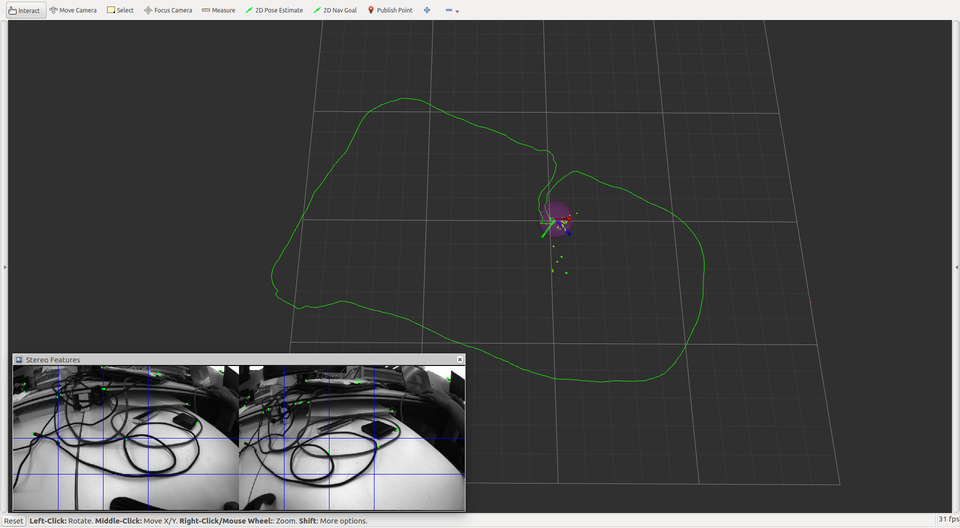

# msckf_vio_cg

Modified version of [KumarRobotics/msckf_vio](https://github.com/KumarRobotics/msckf_vio) (commit e3a39a9 on Jul 26, 2019), a stereo version of MSCKF.

The software takes in synchronized stereo images and IMU messages and generates real-time 6DOF pose estimation of the IMU frame.

* tested on Ubuntu 16.04 with ROS Kinetic
* Paper Draft: *[Robust Stereo Visual Inertial Odometry for Fast Autonomous Flight](https://arxiv.org/abs/1712.00036)*


## Build

```sh
mkdir -p ws_msckf/src
cd ws_msckf/src
git clone xxx
cd ../
catkin_make --pkg msckf_vio --cmake-args -DCMAKE_BUILD_TYPE=Release
```

## Run

### with Dataset

* run with EuRoC dataset V1_01_easy.bag
  ```sh
  roslaunch msckf_vio msckf_vio_euroc.launch [rviz:=true]
  ```

* Note
  - First obtain either the [EuRoC](https://projects.asl.ethz.ch/datasets/doku.php?id=kmavvisualinertialdatasets) or the [UPenn fast flight](https://github.com/KumarRobotics/msckf_vio/wiki/Dataset) dataset.
  - Recommended EuRoC ROS Bags: [Vicon Room 1 01](http://robotics.ethz.ch/~asl-datasets/ijrr_euroc_mav_dataset/vicon_room1/V1_01_easy/V1_01_easy.bag)、[Vicon Room 1 02](http://robotics.ethz.ch/~asl-datasets/ijrr_euroc_mav_dataset/vicon_room1/V1_02_easy/V1_02_easy.bag)
  - If running with MH_01_easy.bag, it will drift quickly.

### with Live Camera

* run with MYNTEYE-S1030 (Stereo + IMU)
  ```sh
  roslaunch msckf_vio msckf_vio_mynteye_s1030.launch [rviz:=true]
  ```
  


## Calibration

An accurate calibration is crucial for successfully running the software. To get the best performance of the software, the stereo cameras and IMU should be hardware synchronized. Note that for the stereo calibration, which includes the camera intrinsics, distortion, and extrinsics between the two cameras, you have to use a calibration software. **Manually setting these parameters will not be accurate enough.** [Kalibr](https://github.com/ethz-asl/kalibr) can be used for the stereo calibration and also to get the transformation between the stereo cameras and IMU. The yaml file generated by Kalibr can be directly used in this software. See calibration files in the `config` folder for details. The two calibration files in the `config` folder should work directly with the EuRoC and [fast flight](https://github.com/KumarRobotics/msckf_vio/wiki) datasets. The convention of the calibration file is as follows:

`camx/T_cam_imu`: takes a vector from the IMU frame to the camx frame.
`cam1/T_cn_cnm1`: takes a vector from the cam0 frame to the cam1 frame.

The filter uses the first 200 IMU messages to initialize the gyro bias, acc bias, and initial orientation. Therefore, **the robot is required to start from a stationary state in order to initialize the VIO successfully**.


## ROS Nodes

### `image_processor` node

**Subscribed Topics**

* `imu` (`sensor_msgs/Imu`): IMU messages is used for compensating rotation in feature tracking, and 2-point RANSAC.

* `cam[x]_image` (`sensor_msgs/Image`): Synchronized stereo images.

**Published Topics**

* `features` (`msckf_vio/CameraMeasurement`): Records the feature measurements on the current stereo image pair.

* `tracking_info` (`msckf_vio/TrackingInfo`): Records the feature tracking status for debugging purpose.

* `debug_stereo_img` (`sensor_msgs::Image`): Draw current features on the stereo images for debugging purpose. Note that this debugging image is only generated upon subscription.

### `vio` node

**Subscribed Topics**

* `imu` (`sensor_msgs/Imu`): IMU measurements.

* `features` (`msckf_vio/CameraMeasurement`): Stereo feature measurements from the `image_processor` node.

**Published Topics**

* `odom` (`nav_msgs/Odometry`): Odometry of the IMU frame including a proper covariance.

* `feature_point_cloud` (`sensor_msgs/PointCloud2`): Shows current features in the map which is used for estimation.
