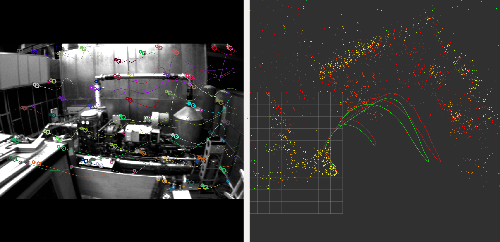

# msckf_mono

Monocular MSCKF with ROS Support.

The actual MSCKF is fully templated based on the floating point type that you want. It should be easy to compile for applications that see real speedups from smaller floating point sizes.

We have run this on platforms ranging from the odroid to a modern laptop, so hopefully it should work on whatever device you want.

-----

# Requirements

- ROS Kinetic with Boost, OpenCV and Eigen
- fast: https://github.com/uzh-rpg/fast

# Run with Dataset

* Euroc Dataset -- ROS Bag

```sh
# Modify the path of bag file before running the launch file
roslaunch msckf_mono euroc.launch # default MH_03_medium.bag
```

* Euroc Dataset -- ASL Format

```sh
# Place `%YAML:1.0` at the top of each YAML file of the ASL dataset. Currently OpenCV is being used to load these YAMLs and expects this header to exist.

# The stand_still_end is going to be the time just before the quad takes off for the actual sequence--take care to find this before starting the MSCKF.

roslaunch msckf_mono asl_msckf.launch data_set_path:=<directory of mav0 inside of sequence> stand_still_start:=<time to start at with dot at the end>
```

eg:

```sh
roslaunch msckf_mono asl_msckf.launch data_set_path:=/home/cg/projects/datasets/euroc/MH_01_easy/mav0 stand_still_start:=1403636601213555456. stand_still_end:=1403636763813555456.
```



# TODO
- ROS Nodelet
- Remove OpenCV from opening YAML files
- PennCOSYVIO Dataset support
